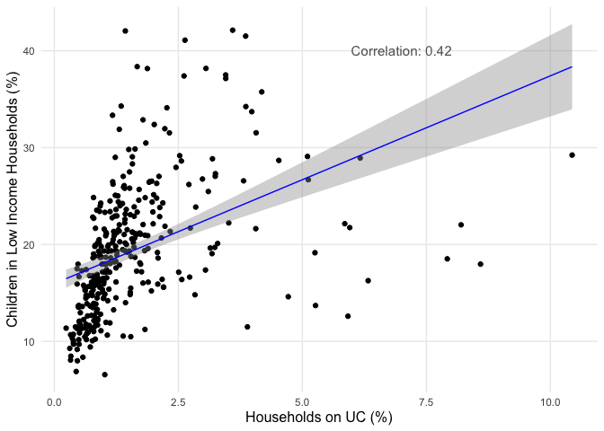

# The Effects of Welfare Reform on Child Poverty in the UK

In this dissertation, I conduct a quantitative analysis of the effect of
welfare policy changes in the UK on the proportion of children living in
relative low-income families.

This Markdown includes the data analysis component of this dissertation.
It will first include some exploratory data analysis, and then will be
used to run the other components of the quantitative analysis of the
impact of UK benefit policies on the number of children living in
relative low income families. Note that the collection and cleaning of
the data that will be used here is done in scripts in the `data-raw`
folder of this repository, and the datasets are available in the `data`
folder.

## Data

### Outcome: Children Living in Relative Low Income Families

Data is downloaded from
[Stat-Xplore](https://stat-xplore.dwp.gov.uk/webapi/jsf/login.xhtml),
the Department of Work and Pensions (DWP) data distribution platform.

-   Low income is a family whose equivalised income is below 60 per cent
    of median household incomes. For Absolute low income involves, the
    median of the 2010/11 year is used. For Relative low income, the
    comparison is made to the median of the current year. This
    dissertation focuses on Relative low income because it better
    adjusts for economic changes. Relative income is Before Housing
    Costs (BHC) and includes contributions from earning, state support
    and pensions. Equivalisation adjusts incomes for household size and
    composition.

-   A family must have claimed Child Benefit and at least one other
    household benefit (Universal Credit, tax credits or Housing Benefit)
    at any point in the year to be classed as low income in these
    statistics

-   Children are defined as dependent individuals aged under 16; or aged
    16 to 19 in full-time non-advanced education.

Visit the dedicated [DWP
page](https://www.gov.uk/government/publications/children-in-low-income-families-local-area-statistics-background-information-and-methodology/background-information-and-methodology-children-in-low-income-families-local-area-statistics)
for further information.

#### Relative measure

To get the **proportion** of children in low income families, I used
[yearly population
estimates](https://www.ons.gov.uk/peoplepopulationandcommunity/populationandmigration/populationestimates/datasets/estimatesofthepopulationforenglandandwales)
provided by the Office for National Statistics (for England and Wales),
and [time series
data](https://www.nrscotland.gov.uk/statistics-and-data/statistics/statistics-by-theme/population/population-estimates/mid-year-population-estimates/population-estimates-time-series-data)
from the National Records of Scotland. Because not all individuals aged
16 to 19 years old are counted as children in the CiRLIF measure,
population counts are summed for individuals aged 0-15 years old, and
used to divide the absolute measure of CiRLIF provided by the DWP.

**Geography: Local authorities (called ltla for Lower Tier Local
Authorities)**

-   England: English local authority districts (309)
-   Wales: Unitary authorities (22)
-   Scotland: Scottish council areas (32)
-   Northern Ireland: District council areas (11)

### Main Independent Variable: Households on Universal Credit

Data for the number of households who have a calculated entitlement for
Universal Credit is downloaded from
[Stat-Xplore](https://stat-xplore.dwp.gov.uk/webapi/jsf/login.xhtml),
the Department of Work and Pensions (DWP) data distribution platform.

Data is also available regarding the family type, number and age of
children, and work status of the household claiming Universal Credit.
For further information, visit the dedicated [DWP
page](https://www.gov.uk/government/publications/universal-credit-statistics-background-information-and-methodology/universal-credit-statistics-background-information-and-methodology).

#### Relative measure

To calculate the proportion of households on Universal Credit for each
local authority, numbers of households on UC were divided by historical
annual estimates of the number of households published by the Office for
National Statistics:
[2004-2019](https://www.ons.gov.uk/peoplepopulationandcommunity/birthsdeathsandmarriages/families/adhocs/13586estimatednumberofhouseholdsbyselectedhouseholdtypeslocalauthoritiesinenglandandwalescountiesandregionsofenglandscottishcouncilareasandgreatbritainconstituentcountries2004to2019),
[2020](https://www.ons.gov.uk/peoplepopulationandcommunity/birthsdeathsandmarriages/families/adhocs/14432estimatednumberofhouseholdsingreatbritaininnuts1nuts3englishandwelshlocalauthoritiesandscottishcouncilareas2020),
[2021](https://www.ons.gov.uk/datasets/TS041/editions/2021/versions/3).

**Geography: Local authorities (called ltla for Lower Tier Local
Authorities)**

-   England: English local authority districts (309)
-   Wales: Unitary authorities (22)
-   Scotland: Scottish council areas (32)
-   *[Data for Northern
    Ireland](https://www.communities-ni.gov.uk/articles/universal-credit-statistics)
    is made available by the Northern Ireland Department for
    Communities, but not yet collected in this package*

## I) Relationship Between Households on UC and Children in Low Income Families

I start with an examination of the relationship between the rollout of
Universal Credit, more precisely the proportion of households on
Universal Credit, and the proportion of children living in low income
household.

I join the datasets of households on UC and children living in low
income, on local authority and year.

    data("children_low_income_ltla")
    data("UC_households_ltla")

    uc_children_df <- UC_households_ltla |>
      left_join(children_low_income_ltla) |>
      select(ltla21_code, ltla21_name, year, UC_households_perc, children_low_income_perc) |> 
      filter(!is.na(UC_households_perc) & !is.na(children_low_income_perc))

    print(paste0("Number of unique local authorities: ", length(unique(uc_children_df$ltla21_code))))

    ## [1] "Number of unique local authorities: 340"

    head(uc_children_df, 10)

    ## # A tibble: 10 × 5
    ##    ltla21_code ltla21_name    year UC_households_perc children_low_income_perc
    ##    <chr>       <chr>         <dbl>              <dbl>                    <dbl>
    ##  1 E06000047   County Durham  2016              0.914                     23.4
    ##  2 E06000047   County Durham  2017              1.91                      26.4
    ##  3 E06000047   County Durham  2018              3.84                      26.9
    ##  4 E06000047   County Durham  2019              9.02                      27.3
    ##  5 E06000047   County Durham  2020             12.4                       32.3
    ##  6 E06000047   County Durham  2021             19.2                       36.0
    ##  7 E06000047   County Durham  2022             18.6                       30.8
    ##  8 E06000005   Darlington     2016              0.717                     21.7
    ##  9 E06000005   Darlington     2017              2.06                      24.8
    ## 10 E06000005   Darlington     2018              2.33                      26.8

There is data for a total of 340 local authorities covering 2016 to
2022, leading to 2380 observations across England, Wales and Scotland.

### Initial observation

    summary_statistics <- uc_children_df |> 
      group_by(year) |> 
      summarise(
        median_children_low_income = median(children_low_income_perc),
        lower_IQR_children_low_income = quantile(children_low_income_perc, 0.25),
        upper_IQR_children_low_income = quantile(children_low_income_perc, 0.75)
      )

    print(summary_statistics)

    ## # A tibble: 7 × 4
    ##    year median_children_low_income lower_IQR_children_l…¹ upper_IQR_children_l…²
    ##   <dbl>                      <dbl>                  <dbl>                  <dbl>
    ## 1  2016                       17.8                   14.1                   22.2
    ## 2  2017                       18.7                   14.7                   23.0
    ## 3  2018                       19.6                   15.1                   24.5
    ## 4  2019                       19.5                   15.1                   24.1
    ## 5  2020                       20.8                   16.0                   26.5
    ## 6  2021                       19.5                   14.9                   26.4
    ## 7  2022                       22.3                   16.6                   28.0
    ## # ℹ abbreviated names: ¹​lower_IQR_children_low_income,
    ## #   ²​upper_IQR_children_low_income

There is a noticeable increase in the proportion of children living in
relative low income households. The first question is: is this rise in
child poverty in some parts of the UK concentrated in areas where more
people are claiming UC?

### Scatterplot

**Figure 1. Binned scatterplot of the proportion of household claiming
UC and proportion of children living in relative low income households
across local authorities (2017)**

    uc_children_2017_df <- uc_children_df |>
      filter(year == 2017)

    ggplot(uc_children_2017_df, aes(x = UC_households_perc, y = children_low_income_perc)) +
      geom_point()

Figure 1 is a binned scatterplot of the proportion of households
claiming Universal Credit (x-axis) and the proportion of children living
in low income families in 2017. It suggests a strong positive
relationship across local authorities. Of course, this correlation could
be driven by underlying characteristics of the local authorities.
(Reeves & Loopstra, 2021: 9)

### Fixed-Effects Model

A first baseline fixed effects (time and space) model allows to explore
whether this relationship remains even after controlling for
time-invariant local authority characteristics and time trends.

*Note: Standard errors are clustered for repeated observations within
local authorities.*

    uc_children_fem <- 
      feols(data = uc_children_df, 
            children_low_income_perc ~ UC_households_perc | ltla21_code + year,
            cluster = ~ltla21_code)

    summary(uc_children_fem)

    ## OLS estimation, Dep. Var.: children_low_income_perc
    ## Observations: 2,380 
    ## Fixed-effects: ltla21_code: 340,  year: 7
    ## Standard-errors: Clustered (ltla21_code) 
    ##                    Estimate Std. Error t value   Pr(>|t|)    
    ## UC_households_perc 0.137705   0.026661 5.16513 4.1074e-07 ***
    ## ---
    ## Signif. codes:  0 '***' 0.001 '**' 0.01 '*' 0.05 '.' 0.1 ' ' 1
    ## RMSE: 1.97767     Adj. R2: 0.923087
    ##                 Within R2: 0.025308

The results of this first model show that for every 1 percentage point
increase in households receiving UC, there is a 0.138 percentage point
increase in the proportion of children living in low income families.
This relationship is statistically significant at all conventional
thresholds.

**Important notes**:

1.  The key assumption needed for a valid estimation of a causal effect
    with this fixed-effects model is the parallel trends assumption.
    That is, local authorities which have **not** displayed an increase
    in UC caseload would have seen the same change in the proportion of
    children living in low income families as local authorities which
    have indeed displayed an increase in proportion of households on UC.
    This assumption needs to be studied further.
2.  It would be benefiticial to control for potentially time varying
    local authority characteristics such as unemployment. This would
    make the parallel trends assumption more plausible. More data
    collection is necessary for that.
