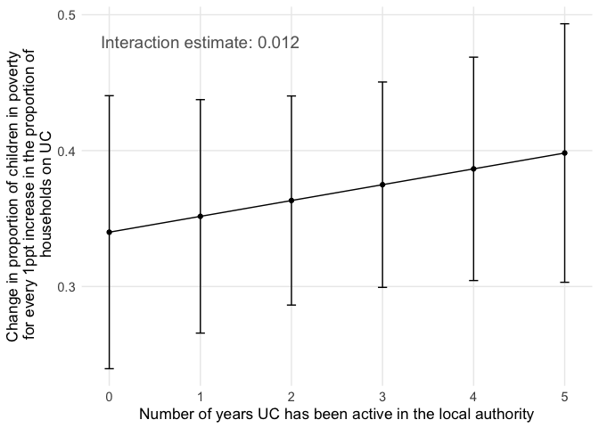
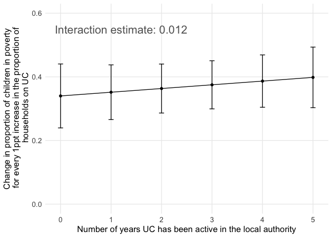

# The Effects of Welfare Reform on Child Poverty in the UK

In this dissertation, I conduct a quantitative analysis of the effect of
welfare policy changes in the UK on the proportion of children living in
relative low-income families.

This Markdown includes the data analysis component of this dissertation.
It will first include some exploratory data analysis, and then will be
used to run the other components of the quantitative analysis of the
impact of UK benefit policies on the number of children living in
relative low income families. Note that the collection and cleaning of
the data that will be used here is done in scripts in the `data-raw`
folder of this repository, and the datasets are available in the `data`
folder.

## Data

### Outcome: Children Living in Relative Low Income Families

Data is downloaded from
[Stat-Xplore](https://stat-xplore.dwp.gov.uk/webapi/jsf/login.xhtml),
the Department of Work and Pensions (DWP) data distribution platform.

-   Low income is a family whose equivalised income is below 60 per cent
    of median household incomes. For Absolute low income involves, the
    median of the 2010/11 year is used. For Relative low income, the
    comparison is made to the median of the current year. This
    dissertation focuses on Relative low income because it better
    adjusts for economic changes. Relative income is Before Housing
    Costs (BHC) and includes contributions from earning, state support
    and pensions. Equivalisation adjusts incomes for household size and
    composition.

-   A family must have claimed Child Benefit and at least one other
    household benefit (Universal Credit, tax credits or Housing Benefit)
    at any point in the year to be classed as low income in these
    statistics

-   Children are defined as dependent individuals aged under 16; or aged
    16 to 19 in full-time non-advanced education.

Visit the dedicated [DWP
page](https://www.gov.uk/government/publications/children-in-low-income-families-local-area-statistics-background-information-and-methodology/background-information-and-methodology-children-in-low-income-families-local-area-statistics)
for further information.

#### Relative measure

To get the **proportion** of children in low income families, I used
[yearly population
estimates](https://www.ons.gov.uk/peoplepopulationandcommunity/populationandmigration/populationestimates/datasets/estimatesofthepopulationforenglandandwales)
provided by the Office for National Statistics (for England and Wales),
and [time series
data](https://www.nrscotland.gov.uk/statistics-and-data/statistics/statistics-by-theme/population/population-estimates/mid-year-population-estimates/population-estimates-time-series-data)
from the National Records of Scotland. Because not all individuals aged
16 to 19 years old are counted as children in the CiRLIF measure,
population counts are summed for individuals aged 0-15 years old, and
used to divide the absolute measure of CiRLIF provided by the DWP.

**Geography: Local authorities (called ltla for Lower Tier Local
Authorities)**

-   England: English local authority districts (309)
-   Wales: Unitary authorities (22)
-   Scotland: Scottish council areas (32)
-   Northern Ireland: District council areas (11)

### Main Independent Variable: Households on Universal Credit

Data for the number of households who have a calculated entitlement for
Universal Credit is downloaded from
[Stat-Xplore](https://stat-xplore.dwp.gov.uk/webapi/jsf/login.xhtml),
the Department of Work and Pensions (DWP) data distribution platform.

Data is also available regarding the family type, number and age of
children, and work status of the household claiming Universal Credit.
For further information, visit the dedicated [DWP
page](https://www.gov.uk/government/publications/universal-credit-statistics-background-information-and-methodology/universal-credit-statistics-background-information-and-methodology).

#### Relative measure

To calculate the proportion of households on Universal Credit for each
local authority, numbers of households on UC were divided by historical
annual estimates of the number of households published by the Office for
National Statistics:
[2004-2019](https://www.ons.gov.uk/peoplepopulationandcommunity/birthsdeathsandmarriages/families/adhocs/13586estimatednumberofhouseholdsbyselectedhouseholdtypeslocalauthoritiesinenglandandwalescountiesandregionsofenglandscottishcouncilareasandgreatbritainconstituentcountries2004to2019),
[2020](https://www.ons.gov.uk/peoplepopulationandcommunity/birthsdeathsandmarriages/families/adhocs/14432estimatednumberofhouseholdsingreatbritaininnuts1nuts3englishandwelshlocalauthoritiesandscottishcouncilareas2020),
[2021](https://www.ons.gov.uk/datasets/TS041/editions/2021/versions/3).

**Geography: Local authorities (called ltla for Lower Tier Local
Authorities)**

-   England: English local authority districts (309)
-   Wales: Unitary authorities (22)
-   Scotland: Scottish council areas (32)
-   *[Data for Northern
    Ireland](https://www.communities-ni.gov.uk/articles/universal-credit-statistics)
    is made available by the Northern Ireland Department for
    Communities, but not yet collected in this package*

#### Universal Credit Rollout: Binary variable

The official [UC ‘Full Service’ transition rollout
schedule](https://assets.publishing.service.gov.uk/media/5ab507c8e5274a1aa2d414d1/universal-credit-transition-rollout-schedule.pdf)
published by the DWP was used to create explanatory variables measuring
cross-local authority variation in the timing of the UC rollout (Hardie,
2023: 1035). The first is a binary variable indicating whether UC ‘Full
Service’ had rolled out yet in each year in each local authority in the
sample (coded: 0 = ‘no’, 1 = ‘yes’). To mitigate bias and ensure
robustness in the conversion of the monthly Universal Credit rollout
data to annual data for the analysis, I coded multiple variables with
different thresholds — December of the previous year, April, and October
— to determine the minimum duration of Universal Credit presence within
a financial year required for a local authority to be classified as
having implemented UC. This first binary variable allows to study the
staggered rollout of UC as a natural experiment, with a delayed
treatment across local authorities.

The ‘Full Service’ iteration of Universal Credit was chosen for analysis
because it represents the comprehensive form of UC, making it accessible
to all types of claimants, including those with housing expenses. The
initial ‘Live Service’ variant was not considered in this study due to
its limited scope, primarily involving claims from single, unemployed
individuals without housing cost claims, thereby having minimal impact
on children from low-income families. (Hardie, 2023: 1035).

#### Universal Credit Rollout Duration: Categorical variable

If a significant effect of the rollout on children living in low income
families in indeed observed, this effect could be expected to vary
depending on how long UC has been rollout out in the local authority.
One possible scenario is that the effect fades over time because the
administrative system adapts. Conversely, as time goes on, more people
are reached by Universal Credit, and the effect on children in low
income families could become larger. For the purpose of studying the
long-term effect of the rollout, we build a secondary independent
variable ‘UC Full Service Rollout by Rollout Length’; a categorical
variable indicating whether UC ‘Full Service’ had rolled out yet in each
month in each local authority , and if so for how long (coded: 0 = ‘No
(pre-rollout)’ 1 = ‘Yes (1-6 months post)’, 2 = ‘Yes (7-12 months
post)’, 3 = ‘Yes (13-24 months post)’, and 4 = ‘Yes(25+ months post)’)
(Hardie, 2023: 1035). The proportion of children in low income families
is measured for a financial year, so the number of months is measured
from the month of the rollout to the middle of the financial year
(October).

## I) Relationship Between Households on UC and Children in Low Income Families

I start with an examination of the relationship between the rollout of
Universal Credit, more precisely the proportion of households on
Universal Credit, and the proportion of children living in low income
household.

I join the datasets of households on UC and children living in low
income, on local authority and year.

    data("dataset_part1")

    print(paste0("Number of unique local authorities: ", 
                 length(unique(dataset_part1$ltla21_code))))

    ## [1] "Number of unique local authorities: 340"

    head(dataset_part1, 10)

    ## # A tibble: 10 × 6
    ##    ltla21_code ltla21_name    year UC_households_perc children_low_income_perc
    ##    <chr>       <chr>         <dbl>              <dbl>                    <dbl>
    ##  1 E06000047   County Durham  2016              0.914                     23.4
    ##  2 E06000047   County Durham  2017              1.91                      26.4
    ##  3 E06000047   County Durham  2018              3.84                      26.9
    ##  4 E06000047   County Durham  2019              9.02                      27.3
    ##  5 E06000047   County Durham  2020             12.4                       32.3
    ##  6 E06000005   Darlington     2016              0.717                     21.7
    ##  7 E06000005   Darlington     2017              2.06                      24.8
    ##  8 E06000005   Darlington     2018              2.33                      26.8
    ##  9 E06000005   Darlington     2019              7.56                      26.6
    ## 10 E06000005   Darlington     2020             12.5                       32.0
    ## # ℹ 1 more variable: unemployment_perc <dbl>

There is data for a total of 340 local authorities covering 2016 to
2022, leading to 2380 observations across England, Wales and Scotland.

### Initial observation

    summary_statistics <- dataset_part1 |> 
      group_by(year) |> 
      summarise(
        median_children_low_income = median(children_low_income_perc),
        lower_IQR_children_low_income = quantile(children_low_income_perc, 0.25),
        upper_IQR_children_low_income = quantile(children_low_income_perc, 0.75)
      )

    print(summary_statistics)

    ## # A tibble: 5 × 4
    ##    year median_children_low_income lower_IQR_children_l…¹ upper_IQR_children_l…²
    ##   <dbl>                      <dbl>                  <dbl>                  <dbl>
    ## 1  2016                       17.8                   14.1                   22.2
    ## 2  2017                       18.7                   14.6                   23.0
    ## 3  2018                       19.6                   15.1                   24.5
    ## 4  2019                       19.5                   15.1                   24.1
    ## 5  2020                       20.8                   16.0                   26.5
    ## # ℹ abbreviated names: ¹​lower_IQR_children_low_income,
    ## #   ²​upper_IQR_children_low_income

There is a noticeable increase in the proportion of children living in
relative low income households. The first question is: is this rise in
child poverty in some parts of the UK concentrated in areas where more
people are claiming UC?

### Scatterplot

**Figure 1. Binned scatterplot of the proportion of household claiming
UC and proportion of children living in relative low income households
across local authorities (2017)**

    uc_children_2017_df <- dataset_part1 |>
      filter(year == 2017)

    cor_value <- round(cor(uc_children_2017_df$UC_households_perc, uc_children_2017_df$children_low_income_perc),2)

    ggplot(uc_children_2017_df, aes(x = UC_households_perc, y = children_low_income_perc)) +
      geom_point() +
      geom_smooth(method = "lm", color = "blue", linewidth = 0.5) +
      labs(x = "Households on UC (%)", 
           y = "Children in Low Income Households (%)") +
      annotate("text", x=7, y=40, label = paste("Correlation:", cor_value), size = 4, colour = "#636363") +
      theme_minimal()+
      theme(
        legend.position = "none",
        panel.grid.minor = element_blank(),
        axis.title = element_text(size = 12)
      )

    ## `geom_smooth()` using formula = 'y ~ x'

Figure 1 is a binned scatterplot of the proportion of households
claiming Universal Credit (x-axis) and the proportion of children living
in low income families in 2017. It suggests a strong positive
relationship across local authorities. Of course, this correlation could
be driven by underlying characteristics of the local authorities.
(Reeves & Loopstra, 2021: 9)

### Fixed-Effects Model - Continuous Independent Variable (// Reeves & Loopstra, 2021)

A first baseline fixed effects (time and space) model allows to explore
whether this relationship remains even after controlling for
time-invariant local authority characteristics and time trends. In a
second model, we add a time-varying local authority level control:
unemployment rate.

*Note: Standard errors are clustered for repeated observations within
local authorities.*

    fe_model_baseline <- 
      feols(data = dataset_part1, 
            children_low_income_perc ~ UC_households_perc | ltla21_code + year,
            cluster = ~ltla21_code)

    summary(fe_model_baseline)

    ## OLS estimation, Dep. Var.: children_low_income_perc
    ## Observations: 1,696 
    ## Fixed-effects: ltla21_code: 340,  year: 5
    ## Standard-errors: Clustered (ltla21_code) 
    ##                    Estimate Std. Error t value  Pr(>|t|)    
    ## UC_households_perc 0.314418    0.03461 9.08451 < 2.2e-16 ***
    ## ---
    ## Signif. codes:  0 '***' 0.001 '**' 0.01 '*' 0.05 '.' 0.1 ' ' 1
    ## RMSE: 1.22367     Adj. R2: 0.964942
    ##                 Within R2: 0.120166

    # Add unemployment control
    fe_model1 <- 
      feols(data = dataset_part1, 
            children_low_income_perc ~ UC_households_perc + unemployment_perc | ltla21_code + year,
            cluster = ~ltla21_code)

    ## NOTE: 5 observations removed because of NA values (RHS: 5).

    summary(fe_model1)

    ## OLS estimation, Dep. Var.: children_low_income_perc
    ## Observations: 1,691 
    ## Fixed-effects: ltla21_code: 339,  year: 5
    ## Standard-errors: Clustered (ltla21_code) 
    ##                     Estimate Std. Error  t value  Pr(>|t|)    
    ## UC_households_perc  0.288293   0.030577  9.42837 < 2.2e-16 ***
    ## unemployment_perc  -0.837036   0.085875 -9.74711 < 2.2e-16 ***
    ## ---
    ## Signif. codes:  0 '***' 0.001 '**' 0.01 '*' 0.05 '.' 0.1 ' ' 1
    ## RMSE: 1.16618     Adj. R2: 0.968137
    ##                 Within R2: 0.202392

The results of this first model show that for every 1 percentage point
increase in households receiving UC, there is a 0.315 percentage point
increase in the proportion of children living in low income families.
This relationship is statistically significant at all conventional
thresholds. This estimate is not strongly affected, neither in its scale
nor in its statistical significance when controlling for unemployment
rates. This finding reinforces the claim that the parallel trends
assumption more plausible is this situation.

#### Adding an interaction term with duration of rollout

I add a variable for the number of months UC has been rolled out in the
local authority. This is calculating for each year by doing:
01-01-year - month of the UC rollout.

    data("dataset_part2")

    head(dataset_part2)

    ## # A tibble: 6 × 8
    ##   ltla21_code ltla21_name    year UC_households_perc children_low_income_perc
    ##   <chr>       <chr>         <dbl>              <dbl>                    <dbl>
    ## 1 E06000047   County Durham  2016              0.914                     23.4
    ## 2 E06000047   County Durham  2017              1.91                      26.4
    ## 3 E06000047   County Durham  2018              3.84                      26.9
    ## 4 E06000047   County Durham  2019              9.02                      27.3
    ## 5 E06000047   County Durham  2020             12.4                       32.3
    ## 6 E06000005   Darlington     2016              0.717                     21.7
    ## # ℹ 3 more variables: unemployment_perc <dbl>, months_active <dbl>,
    ## #   years_active <dbl>

Now let’s add the interaction term in the fixed-effects model to see if
the effect of the UC rollout is moderated by the number of months
Universal Credit has been active in the local authority. Standard errors
are still clustered by local authority.

    fe_model2 <- 
      feols(data = dataset_part2, 
            children_low_income_perc ~ 
              UC_households_perc + 
              years_active +
              UC_households_perc * years_active +
              unemployment_perc | ltla21_code + year,
            cluster = ~ltla21_code)

    ## NOTE: 15 observations removed because of NA values (RHS: 15).

    summary(fe_model2)

    ## OLS estimation, Dep. Var.: children_low_income_perc
    ## Observations: 1,681 
    ## Fixed-effects: ltla21_code: 337,  year: 5
    ## Standard-errors: Clustered (ltla21_code) 
    ##                                  Estimate Std. Error   t value   Pr(>|t|)    
    ## UC_households_perc               0.339966   0.051249  6.633593 1.3115e-10 ***
    ## years_active                    -0.903514   0.187892 -4.808695 2.2965e-06 ***
    ## unemployment_perc               -0.773854   0.087205 -8.873999  < 2.2e-16 ***
    ## UC_households_perc:years_active  0.011652   0.012761  0.913093 3.6185e-01    
    ## ---
    ## Signif. codes:  0 '***' 0.001 '**' 0.01 '*' 0.05 '.' 0.1 ' ' 1
    ## RMSE: 1.15231     Adj. R2: 0.968976
    ##                 Within R2: 0.225477

We can visualise the marginal effects of the interaction (change in the
increase in the proportion of children in low income families for every
1ppt increase in the proportion of households on UC), using the
interaction term:

    # Extract coefficients
    beta_1 <- coef(fe_model2)["UC_households_perc"]
    beta_3 <- coef(fe_model2)["UC_households_perc:years_active"]

    # For confidence interval:
    # Compute variance of the marginal effect of "proportion of households on UC"
    # Marginal effect: b1 + b3.Years
    # var(aX + bY) = a^2.var(X) + b^2.var(Y) + 2ab.cov(X.Y)
    # In our case: var(β1 + β3.Years) = var(β1) + Years^2.var(β3) + 2.Years.cov(β1.β3)

    # Extract variances
    # Get the variance-covariance matrix of the model's estimates
    vcov_matrix <- vcov(fe_model2)

    var_beta_1 <- vcov_matrix["UC_households_perc", "UC_households_perc"]
    var_beta_3 <- vcov_matrix["UC_households_perc:years_active", "UC_households_perc:years_active"]
    cov_beta_1_beta_3 <- vcov_matrix["UC_households_perc", "UC_households_perc:years_active"]

    # Build the dataset (95% confidence interval)
    interaction_visualisation <-
      tibble(
        Year = 0:5,
        Marginal_Effect = beta_1 + (beta_3 * Year),
        Variance = var_beta_1 + Year^2 * var_beta_3 + 2 * Year * cov_beta_1_beta_3,
        CI_lower = Marginal_Effect - 1.96 * sqrt(Variance),
        CI_upper = Marginal_Effect + 1.96 * sqrt(Variance)
      )

Now on with the visualisation:

    # Visualise
    ggplot(interaction_visualisation, aes(x = Year, y = Marginal_Effect)) +
      geom_line() +
      geom_point() +
      geom_errorbar(aes(ymin = CI_lower, ymax = CI_upper), width = 0.1) +
      theme_minimal() + # This sets a minimal theme for the plot
      labs(
        x = "Number of years UC has been active in the local authority",
        y = "Change in proportion of children in poverty\n for every 1ppt increase in the proportion of\n households on UC"
      ) +
      annotate("text", x = 1, y = 0.48, label = paste("Interaction estimate:", round(beta_3, 3)), size = 5, colour = "#636363") +
      theme_minimal() +
      theme(
        legend.position = "none",
        panel.grid.minor = element_blank(),
        axis.title = element_text(size = 13),
        axis.text = element_text(size =11)
      )

### Impact of family type on the effect of UC rollout on child poverty

The literature suggests specific design features of Universal Credit may
have affected lone parents disproportionately.

A first way to examine this possibility is to take into account local
authority level (time-varying) characteristics. After having compiled
data on the percentage of lone parents households in local authorities
(2016-2019), I add an interaction term to the model.

    data("dataset_part3")

    fe_model_baseline2 <- 
      feols(data = dataset_part3, 
            children_low_income_perc ~ 
              UC_households_perc + 
              unemployment_perc | ltla21_code + year,
            cluster = ~ltla21_code)

    ## NOTE: 4 observations removed because of NA values (RHS: 4).

    summary(fe_model_baseline2)

    ## OLS estimation, Dep. Var.: children_low_income_perc
    ## Observations: 1,352 
    ## Fixed-effects: ltla21_code: 339,  year: 4
    ## Standard-errors: Clustered (ltla21_code) 
    ##                     Estimate Std. Error   t value   Pr(>|t|)    
    ## UC_households_perc  0.207862   0.029679   7.00358 1.3539e-11 ***
    ## unemployment_perc  -0.953126   0.090898 -10.48571  < 2.2e-16 ***
    ## ---
    ## Signif. codes:  0 '***' 0.001 '**' 0.01 '*' 0.05 '.' 0.1 ' ' 1
    ## RMSE: 1.03568     Adj. R2: 0.971143
    ##                 Within R2: 0.200176

    fe_model3 <- 
      feols(data = dataset_part3, 
            children_low_income_perc ~ 
              UC_households_perc + 
              lone_parent_households_perc +
              UC_households_perc * lone_parent_households_perc +
              unemployment_perc | ltla21_code + year,
            cluster = ~ltla21_code)

    ## NOTE: 17 observations removed because of NA values (RHS: 17).

    summary(fe_model3)

    ## OLS estimation, Dep. Var.: children_low_income_perc
    ## Observations: 1,339 
    ## Fixed-effects: ltla21_code: 339,  year: 4
    ## Standard-errors: Clustered (ltla21_code) 
    ##                                                 Estimate Std. Error    t value
    ## UC_households_perc                             -0.049498   0.076232  -0.649301
    ## lone_parent_households_perc                    -0.045689   0.022328  -2.046259
    ## unemployment_perc                              -0.921752   0.088147 -10.456966
    ## UC_households_perc:lone_parent_households_perc  0.021393   0.005418   3.948631
    ##                                                  Pr(>|t|)    
    ## UC_households_perc                             5.1659e-01    
    ## lone_parent_households_perc                    4.1504e-02 *  
    ## unemployment_perc                               < 2.2e-16 ***
    ## UC_households_perc:lone_parent_households_perc 9.5669e-05 ***
    ## ---
    ## Signif. codes:  0 '***' 0.001 '**' 0.01 '*' 0.05 '.' 0.1 ' ' 1
    ## RMSE: 1.02398     Adj. R2: 0.971776
    ##                 Within R2: 0.214724

We note that, when adding the interaction term, the coefficient for
`UC_households_perc` becomes negative. This is because of a change in
its interpretation. In the presence of interaction terms, the main
effect (coefficient of `UC_households_perc` when the interaction term is
included) represents the effect of the variable at the reference level
(typically zero) of the interacting variable
(`lone_parent_households_perc`). Without the interaction term, the
coefficient of `UC_households_perc` represents the overall, or average,
effect across all levels of `lone_parent_households_perc`.

Let’s visualise this interaction term.

    # Summary of the values for the proportions of lone parent households
    summary(dataset_part3$lone_parent_households_perc)

    ##    Min. 1st Qu.  Median    Mean 3rd Qu.    Max.    NA's 
    ##   1.075   7.692   9.722   9.893  11.787  21.569      17

    # Extract coefficients
    beta_1_part3 <- coef(fe_model3)["UC_households_perc"]
    beta_3_part3 <- coef(fe_model3)["UC_households_perc:lone_parent_households_perc"]

    # Extract variances
    # Get the variance-covariance matrix of the model's estimates
    vcov_matrix_part3 <- vcov(fe_model3)

    var_beta_1_part3 <- vcov_matrix_part3[
      "UC_households_perc", "UC_households_perc"]
    var_beta_3_part3 <- vcov_matrix_part3[
      "UC_households_perc:lone_parent_households_perc",
      "UC_households_perc:lone_parent_households_perc"]
    cov_beta_1_beta_3_part3 <- vcov_matrix_part3[
      "UC_households_perc", "UC_households_perc:lone_parent_households_perc"]

    # Build the dataset (95% confidence interval)
    interaction_visualisation_part3 <-
      tibble(
        Lone_Parents = 1:25,
        Marginal_Effect = beta_1_part3 + (beta_3_part3 * Lone_Parents),
        Variance = var_beta_1_part3 + Lone_Parents^2 * var_beta_3_part3 + 2 * Lone_Parents * cov_beta_1_beta_3_part3,
        CI_lower = Marginal_Effect - 1.96 * sqrt(Variance),
        CI_upper = Marginal_Effect + 1.96 * sqrt(Variance)
      )

Now on with the visualisation:

    # Visualise
    ggplot(interaction_visualisation_part3, aes(x = Lone_Parents, y = Marginal_Effect)) +
      geom_line() +
      geom_point() +
      geom_errorbar(aes(ymin = CI_lower, ymax = CI_upper), width = 0.1) +
      theme_minimal() + # This sets a minimal theme for the plot
      labs(
        x = "Proportion of lone parent households in the local authority",
        y = "Change in proportion of children in poverty\n for every 1ppt increase in the proportion of\n households on UC"
      ) +
      annotate("text", x = 5, y = 0.5, label = paste("Interaction estimate:", round(beta_3_part3, 3)), size = 5, colour = "#636363") +
      theme_minimal() +
      theme(
        legend.position = "none",
        panel.grid.minor = element_blank(),
        axis.title = element_text(size = 13),
        axis.text = element_text(size =11)
      )

Another method to investigate the differentiated impact of UC on lone
parent households, rather than to consider family types as a local
authority level independent variable, is to consider to model two
different dependent variables using data released by the DWP.

Indeed, the number of children living in low income households is
available for different family types.

### Fixed-Effects Model - Binary Independent Variable (UC Full Service Rollout) (// Hardie, 2023)

In the next model, the Universal Credit rollout is studied as a binary
treatment across all local authorities. This additional analysis is
critical to assess a causality link of the rollout of the policy on the
proportion of children living in low income families because it allows
to run placebo tests, which will be detailed later.

    data("uc_rollout_ltla_15mo")
    data("uc_rollout_ltla_12mo")
    data("uc_rollout_ltla_6mo")
    data("children_low_income_ltla")

    uc_rollout_ltla_15mo_joined <- uc_rollout_ltla_15mo |> 
      left_join(children_low_income_ltla)

    ## Joining with `by = join_by(ltla21_code, ltla21_name, year)`

    uc_rollout_ltla_12mo_joined <- uc_rollout_ltla_12mo |> 
      left_join(children_low_income_ltla)

    ## Joining with `by = join_by(ltla21_code, ltla21_name, year)`

    uc_rollout_ltla_6mo_joined <- uc_rollout_ltla_6mo |> 
      left_join(children_low_income_ltla)

    ## Joining with `by = join_by(ltla21_code, ltla21_name, year)`

    uc_children_binary_15mo_fem <- 
      feols(data = uc_rollout_ltla_15mo_joined, 
            children_low_income_perc ~ uc_rolled_out | ltla21_code + year,
            cluster = ~ltla21_code)

    ## NOTE: 372 observations removed because of NA values (LHS: 372).

    summary(uc_children_binary_15mo_fem)

    ## OLS estimation, Dep. Var.: children_low_income_perc
    ## Observations: 1,800 
    ## Fixed-effects: ltla21_code: 358,  year: 5
    ## Standard-errors: Clustered (ltla21_code) 
    ##                Estimate Std. Error  t value Pr(>|t|) 
    ## uc_rolled_out -0.054449   0.097739 -0.55708  0.57782 
    ## ---
    ## Signif. codes:  0 '***' 0.001 '**' 0.01 '*' 0.05 '.' 0.1 ' ' 1
    ## RMSE: 1.29384     Adj. R2: 0.959917
    ##                 Within R2: 8.002e-5

    uc_children_binary_12mo_fem <- 
      feols(data = uc_rollout_ltla_12mo_joined, 
            children_low_income_perc ~ uc_rolled_out | ltla21_code + year,
            cluster = ~ltla21_code)

    ## NOTE: 372 observations removed because of NA values (LHS: 372).

    summary(uc_children_binary_12mo_fem)

    ## OLS estimation, Dep. Var.: children_low_income_perc
    ## Observations: 1,800 
    ## Fixed-effects: ltla21_code: 358,  year: 5
    ## Standard-errors: Clustered (ltla21_code) 
    ##               Estimate Std. Error  t value Pr(>|t|) 
    ## uc_rolled_out 0.136059    0.13793 0.986434  0.32459 
    ## ---
    ## Signif. codes:  0 '***' 0.001 '**' 0.01 '*' 0.05 '.' 0.1 ' ' 1
    ## RMSE: 1.29354     Adj. R2: 0.959936
    ##                 Within R2: 5.492e-4

    uc_children_binary_6mo_fem <- 
      feols(data = uc_rollout_ltla_6mo_joined, 
            children_low_income_perc ~ uc_rolled_out | ltla21_code + year,
            cluster = ~ltla21_code)

    ## NOTE: 372 observations removed because of NA values (LHS: 372).

    summary(uc_children_binary_6mo_fem)

    ## OLS estimation, Dep. Var.: children_low_income_perc
    ## Observations: 1,800 
    ## Fixed-effects: ltla21_code: 358,  year: 5
    ## Standard-errors: Clustered (ltla21_code) 
    ##                Estimate Std. Error   t value Pr(>|t|) 
    ## uc_rolled_out -0.018257   0.113194 -0.161292  0.87195 
    ## ---
    ## Signif. codes:  0 '***' 0.001 '**' 0.01 '*' 0.05 '.' 0.1 ' ' 1
    ## RMSE: 1.29389     Adj. R2: 0.959914
    ##                 Within R2: 1.052e-5

None of the models displays a statistically significant effect of the
rollout of Universal Credit on the proportion of children in low income
families within local authorities. The implications of this finding are
difficult to flesh out because of the potential measurement issues
emerging from the difference in measurement frequency between the
independent variable and outcome.
