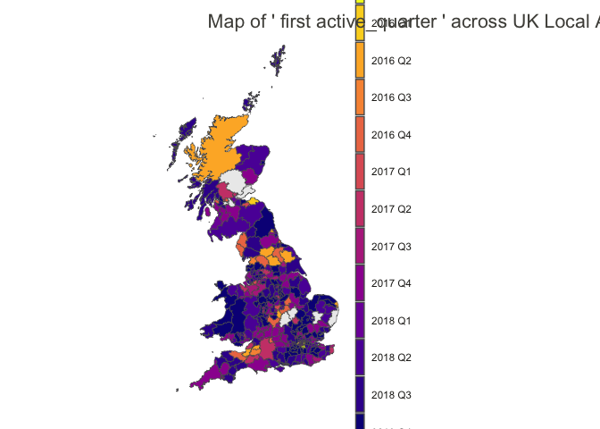
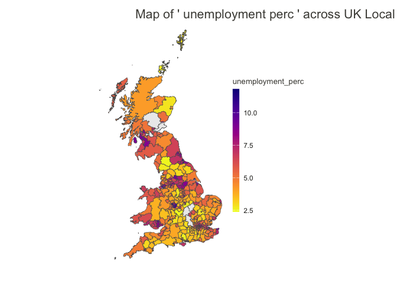

# The Effects of Welfare Reform on Child Poverty in the UK

In this dissertation, I conduct a quantitative analysis of the effect of
welfare policy changes in the UK on the proportion of children living in
relative low-income families.

This Markdown includes the data analysis component of this dissertation.
It will first include some exploratory data analysis, and then will be
used to run the other components of the quantitative analysis of the
impact of UK benefit policies on the number of children living in
relative low income families. Note that the collection and cleaning of
the data that will be used here is done in scripts in the `data-raw`
folder of this repository, and the datasets are available in the `data`
folder.

## Data

### Outcome: Children Living in Relative Low Income Families

Data is downloaded from
[Stat-Xplore](https://stat-xplore.dwp.gov.uk/webapi/jsf/login.xhtml),
the Department of Work and Pensions (DWP) data distribution platform.

-   Low income is a family whose equivalised income is below 60 per cent
    of median household incomes. For Absolute low income involves, the
    median of the 2010/11 year is used. For Relative low income, the
    comparison is made to the median of the current year. This
    dissertation focuses on Relative low income because it better
    adjusts for economic changes. Relative income is Before Housing
    Costs (BHC) and includes contributions from earning, state support
    and pensions. Equivalisation adjusts incomes for household size and
    composition.

-   A family must have claimed Child Benefit and at least one other
    household benefit (Universal Credit, tax credits or Housing Benefit)
    at any point in the year to be classed as low income in these
    statistics

-   Children are defined as dependent individuals aged under 16; or aged
    16 to 19 in full-time non-advanced education.

Visit the dedicated [DWP
page](https://www.gov.uk/government/publications/children-in-low-income-families-local-area-statistics-background-information-and-methodology/background-information-and-methodology-children-in-low-income-families-local-area-statistics)
for further information.

#### Relative measure

To get the **proportion** of children in low income families, I used
[yearly population
estimates](https://www.ons.gov.uk/peoplepopulationandcommunity/populationandmigration/populationestimates/datasets/estimatesofthepopulationforenglandandwales)
provided by the Office for National Statistics (for England and Wales),
and [time series
data](https://www.nrscotland.gov.uk/statistics-and-data/statistics/statistics-by-theme/population/population-estimates/mid-year-population-estimates/population-estimates-time-series-data)
from the National Records of Scotland. Because not all individuals aged
16 to 19 years old are counted as children in the CiRLIF measure,
population counts are summed for individuals aged 0-15 years old, and
used to divide the absolute measure of CiRLIF provided by the DWP.

**Geography: Local authorities (called ltla for Lower Tier Local
Authorities)**

-   England: English local authority districts (309)
-   Wales: Unitary authorities (22)
-   Scotland: Scottish council areas (32)
-   Northern Ireland: District council areas (11)

### Main Independent Variable: Households on Universal Credit

Data for the number of households who have a calculated entitlement for
Universal Credit is downloaded from
[Stat-Xplore](https://stat-xplore.dwp.gov.uk/webapi/jsf/login.xhtml),
the Department of Work and Pensions (DWP) data distribution platform.

Data is also available regarding the family type, number and age of
children, and work status of the household claiming Universal Credit.
For further information, visit the dedicated [DWP
page](https://www.gov.uk/government/publications/universal-credit-statistics-background-information-and-methodology/universal-credit-statistics-background-information-and-methodology).

#### Relative measure

To calculate the proportion of households on Universal Credit for each
local authority, numbers of households on UC were divided by historical
annual estimates of the number of households published by the Office for
National Statistics:
[2004-2019](https://www.ons.gov.uk/peoplepopulationandcommunity/birthsdeathsandmarriages/families/adhocs/13586estimatednumberofhouseholdsbyselectedhouseholdtypeslocalauthoritiesinenglandandwalescountiesandregionsofenglandscottishcouncilareasandgreatbritainconstituentcountries2004to2019),
[2020](https://www.ons.gov.uk/peoplepopulationandcommunity/birthsdeathsandmarriages/families/adhocs/14432estimatednumberofhouseholdsingreatbritaininnuts1nuts3englishandwelshlocalauthoritiesandscottishcouncilareas2020),
[2021](https://www.ons.gov.uk/datasets/TS041/editions/2021/versions/3).

**Geography: Local authorities (called ltla for Lower Tier Local
Authorities)**

-   England: English local authority districts (309)
-   Wales: Unitary authorities (22)
-   Scotland: Scottish council areas (32)
-   *[Data for Northern
    Ireland](https://www.communities-ni.gov.uk/articles/universal-credit-statistics)
    is made available by the Northern Ireland Department for
    Communities, but not yet collected in this package*

#### Universal Credit Rollout: Binary variable (removed)

The official [UC ‘Full Service’ transition rollout
schedule](https://assets.publishing.service.gov.uk/media/5ab507c8e5274a1aa2d414d1/universal-credit-transition-rollout-schedule.pdf)
published by the DWP was used to create explanatory variables measuring
cross-local authority variation in the timing of the UC rollout (Hardie,
2023: 1035). The first is a binary variable indicating whether UC ‘Full
Service’ had rolled out yet in each year in each local authority in the
sample (coded: 0 = ‘no’, 1 = ‘yes’). To mitigate bias and ensure
robustness in the conversion of the monthly Universal Credit rollout
data to annual data for the analysis, I coded multiple variables with
different thresholds — December of the previous year, April, and October
— to determine the minimum duration of Universal Credit presence within
a financial year required for a local authority to be classified as
having implemented UC. This first binary variable allows to study the
staggered rollout of UC as a natural experiment, with a delayed
treatment across local authorities.

The ‘Full Service’ iteration of Universal Credit was chosen for analysis
because it represents the comprehensive form of UC, making it accessible
to all types of claimants, including those with housing expenses. The
initial ‘Live Service’ variant was not considered in this study due to
its limited scope, primarily involving claims from single, unemployed
individuals without housing cost claims, thereby having minimal impact
on children from low-income families. (Hardie, 2023: 1035).

#### Universal Credit Rollout Duration: Categorical variable (needs updating)

If a significant effect of the rollout on children living in low income
families in indeed observed, this effect could be expected to vary
depending on how long UC has been rollout out in the local authority.
One possible scenario is that the effect fades over time because the
administrative system adapts. Conversely, as time goes on, more people
are reached by Universal Credit, and the effect on children in low
income families could become larger. For the purpose of studying the
long-term effect of the rollout, we build a secondary independent
variable ‘UC Full Service Rollout by Rollout Length’; a categorical
variable indicating whether UC ‘Full Service’ had rolled out yet in each
month in each local authority , and if so for how long (coded: 0 = ‘No
(pre-rollout)’ 1 = ‘Yes (1-6 months post)’, 2 = ‘Yes (7-12 months
post)’, 3 = ‘Yes (13-24 months post)’, and 4 = ‘Yes(25+ months post)’)
(Hardie, 2023: 1035). The proportion of children in low income families
is measured for a financial year, so the number of months is measured
from the month of the rollout to the middle of the financial year
(October).

## Quasi-Randomness of the UC Rollout

The UC ‘Full Service’ rollout was staggered, being introduced in
different local authorities at different times between 2016 and 2018
(DWP, 2018). This section examines, both using information released by
the DWP, and descriptive analysis, the extent to which the UC rollout
can be considered as a form of natural experiment.

Let’s start with mapping our pre-treatment variables, and compare them
with the years of the rollout of Universal Credit. A function was
created in this package to map specified variables.

    # Dataset of pre-treatment variables
    data(pre_treatment_df)

    # Map of pre-treatment proportion in children in low income families
    map_variable_ltla(pre_treatment_df, "children_low_income_perc")

    ## Joining with `by = join_by(ltla21_name, ltla21_code)`

    # Map of pre-treatment unemployment
    map_variable_ltla(pre_treatment_df, "unemployment_perc")

    ## Joining with `by = join_by(ltla21_name, ltla21_code)`

    # Map of pre-treatment proportion of lone parent households
    map_variable_ltla(pre_treatment_df, "lone_parent_households_perc")

    ## Joining with `by = join_by(ltla21_name, ltla21_code)`

## I) Relationship Between Households on UC and Children in Low Income Families

I start with an examination of the relationship between the rollout of
Universal Credit, more precisely the proportion of households on
Universal Credit, and the proportion of children living in low income
household.

I join the datasets of households on UC and children living in low
income, on local authority and year.

    data("dataset_part1")

    print(paste0("Number of unique local authorities: ", 
                 length(unique(dataset_part1$ltla21_code))))

    ## [1] "Number of unique local authorities: 339"

    summary(dataset_part1)

    ##  ltla21_code        ltla21_name             year      UC_households_perc
    ##  Length:1691        Length:1691        Min.   :2016   Min.   : 0.0000   
    ##  Class :character   Class :character   1st Qu.:2017   1st Qu.: 0.9125   
    ##  Mode  :character   Mode  :character   Median :2018   Median : 2.3233   
    ##                                        Mean   :2018   Mean   : 4.0132   
    ##                                        3rd Qu.:2019   3rd Qu.: 6.1238   
    ##                                        Max.   :2020   Max.   :22.2155   
    ##  children_low_income_perc unemployment_perc
    ##  Min.   : 6.122           Min.   : 1.510   
    ##  1st Qu.:14.902           1st Qu.: 3.080   
    ##  Median :19.178           Median : 3.900   
    ##  Mean   :20.124           Mean   : 4.143   
    ##  3rd Qu.:24.061           3rd Qu.: 4.985   
    ##  Max.   :47.981           Max.   :10.080

    sd(dataset_part1$UC_households_perc)

    ## [1] 4.050261

    sd(dataset_part1$children_low_income_perc)

    ## [1] 7.322668

    sd(dataset_part1$unemployment_perc)

    ## [1] 1.379188

There is data for a total of 339 local authorities covering 2016 to
2020, leading to 1691 observations across England, Wales and Scotland.

### Initial observation

    summary_statistics <- dataset_part1 |> 
      group_by(year) |> 
      summarise(
        median_children_low_income = median(children_low_income_perc),
        lower_IQR_children_low_income = quantile(children_low_income_perc, 0.25),
        upper_IQR_children_low_income = quantile(children_low_income_perc, 0.75)
      )

    print(summary_statistics)

    ## # A tibble: 5 × 4
    ##    year median_children_low_income lower_IQR_children_l…¹ upper_IQR_children_l…²
    ##   <dbl>                      <dbl>                  <dbl>                  <dbl>
    ## 1  2016                       17.8                   14.1                   22.3
    ## 2  2017                       18.7                   14.7                   23.1
    ## 3  2018                       19.7                   15.1                   24.5
    ## 4  2019                       19.6                   15.1                   24.1
    ## 5  2020                       20.8                   16.0                   26.6
    ## # ℹ abbreviated names: ¹​lower_IQR_children_low_income,
    ## #   ²​upper_IQR_children_low_income

There is a noticeable increase in the proportion of children living in
relative low income households. The first question is: is this rise in
child poverty in some parts of the UK concentrated in areas where more
people are claiming UC?

### Scatterplot

**Figure 1. Binned scatterplot of the proportion of household claiming
UC and proportion of children living in relative low income households
across local authorities (2017)**

    uc_children_2017_df <- dataset_part1 |>
      filter(year == 2017)

    cor_value <- round(cor(uc_children_2017_df$UC_households_perc, uc_children_2017_df$children_low_income_perc),2)

    ggplot(uc_children_2017_df, aes(x = UC_households_perc, y = children_low_income_perc)) +
      geom_point() +
      geom_smooth(method = "lm", color = "blue", linewidth = 0.5) +
      labs(x = "Households on UC (%)", 
           y = "Children in Low Income Households (%)") +
      annotate("text", x=7, y=40, label = paste("Correlation:", cor_value), size = 4, colour = "#636363") +
      theme_minimal()+
      theme(
        legend.position = "none",
        panel.grid.minor = element_blank(),
        axis.title = element_text(size = 12)
      )

    ## `geom_smooth()` using formula = 'y ~ x'

Figure 1 is a binned scatterplot of the proportion of households
claiming Universal Credit (x-axis) and the proportion of children living
in low income families in 2017. It suggests a strong positive
relationship across local authorities. Of course, this correlation could
be driven by underlying characteristics of the local authorities.
(Reeves & Loopstra, 2021: 9)

### Fixed-Effects Model - Continuous Independent Variable (// Reeves & Loopstra, 2021)

A first baseline fixed effects (time and space) model allows to explore
whether this relationship remains even after controlling for
time-invariant local authority characteristics and time trends. In a
second model, we add a time-varying local authority level control:
unemployment rate.

*Note: Standard errors are clustered for repeated observations within
local authorities.*

    fe_model_baseline <- 
      feols(data = dataset_part1, 
            children_low_income_perc ~ UC_households_perc | ltla21_code + year,
            cluster = ~ltla21_code)

    summary(fe_model_baseline)

    ## OLS estimation, Dep. Var.: children_low_income_perc
    ## Observations: 1,691 
    ## Fixed-effects: ltla21_code: 339,  year: 5
    ## Standard-errors: Clustered (ltla21_code) 
    ##                    Estimate Std. Error t value  Pr(>|t|)    
    ## UC_households_perc 0.317203   0.034769 9.12305 < 2.2e-16 ***
    ## ---
    ## Signif. codes:  0 '***' 0.001 '**' 0.01 '*' 0.05 '.' 0.1 ' ' 1
    ## RMSE: 1.22401     Adj. R2: 0.964925
    ##                 Within R2: 0.121326

    # Add unemployment control
    fe_model1 <- 
      feols(data = dataset_part1, 
            children_low_income_perc ~ UC_households_perc + unemployment_perc | ltla21_code + year,
            cluster = ~ltla21_code)

    summary(fe_model1)

    ## OLS estimation, Dep. Var.: children_low_income_perc
    ## Observations: 1,691 
    ## Fixed-effects: ltla21_code: 339,  year: 5
    ## Standard-errors: Clustered (ltla21_code) 
    ##                     Estimate Std. Error  t value  Pr(>|t|)    
    ## UC_households_perc  0.288293   0.030577  9.42837 < 2.2e-16 ***
    ## unemployment_perc  -0.837036   0.085875 -9.74711 < 2.2e-16 ***
    ## ---
    ## Signif. codes:  0 '***' 0.001 '**' 0.01 '*' 0.05 '.' 0.1 ' ' 1
    ## RMSE: 1.16618     Adj. R2: 0.968137
    ##                 Within R2: 0.202392

    # Weird negative coefficient for unemployment, could there be an interaction?
    fe_model_extra <- 
      feols(data = dataset_part1, 
            children_low_income_perc ~ 
              unemployment_perc * UC_households_perc | ltla21_code + year,
            cluster = ~ltla21_code)

    summary(fe_model_extra)

    ## OLS estimation, Dep. Var.: children_low_income_perc
    ## Observations: 1,691 
    ## Fixed-effects: ltla21_code: 339,  year: 5
    ## Standard-errors: Clustered (ltla21_code) 
    ##                                       Estimate Std. Error   t value   Pr(>|t|)
    ## unemployment_perc                    -1.093469   0.096830 -11.29264  < 2.2e-16
    ## UC_households_perc                   -0.305324   0.085728  -3.56153 4.2160e-04
    ## unemployment_perc:UC_households_perc  0.093389   0.014837   6.29424 9.5849e-10
    ##                                         
    ## unemployment_perc                    ***
    ## UC_households_perc                   ***
    ## unemployment_perc:UC_households_perc ***
    ## ---
    ## Signif. codes:  0 '***' 0.001 '**' 0.01 '*' 0.05 '.' 0.1 ' ' 1
    ## RMSE: 1.1176     Adj. R2: 0.970714
    ##                Within R2: 0.267455

The results of this first model show that for every 1 percentage point
increase in households receiving UC, there is a 0.315 percentage point
increase in the proportion of children living in low income families.
This relationship is statistically significant at all conventional
thresholds. This estimate is not strongly affected, neither in its scale
nor in its statistical significance when controlling for unemployment
rates. This finding reinforces the claim that the parallel trends
assumption holds is this situation.

For context, we can estimate the increase in the absolute number of
children living in low income households, in a local authority with the
average number of children. For that, we need:

-   to calculate the average percentage point increase of households on
    UC from the previous year,
-   to multiply that by 0.29 to get the estimated percentage point
    increase in the proportion of children in low income families,
-   to get the average number of children each year.

<!-- -->

    dataset_part1_cont <- UC_households_ltla |>
      left_join(children_low_income_ltla) |>
      left_join(unemployment_ltla) |>
      filter(year <= 2020) |>
      filter(!is.na(UC_households_perc) & !is.na(children_low_income_perc) & !is.na(unemployment_perc)) |>
      select(
        ltla21_code, ltla21_name,
        year, UC_households_perc,
        population_0_16, children_low_income_perc
      )

    ## Joining with `by = join_by(ltla21_name, ltla21_code, year)`
    ## Joining with `by = join_by(ltla21_name, ltla21_code, year)`

    # Calculate the year-to-year difference in UC_households_perc for each LA
    dataset_part1_cont <- dataset_part1_cont |> 
      arrange(ltla21_code, year) |> 
      group_by(ltla21_code) |> 
      mutate(UC_households_perc_diff = UC_households_perc - lag(UC_households_perc),
             children_low_income_perc_diff = children_low_income_perc - lag(children_low_income_perc)) |> 
      ungroup()

    yearly_estimates_df <- dataset_part1_cont |> 
      group_by(year) |> 
      summarise(avg_UC_households_perc_diff = mean(UC_households_perc_diff, na.rm = TRUE),
                avg_children_low_income_perc_diff = mean(children_low_income_perc_diff, na.rm = TRUE),
                avg_0_16_pop = mean(population_0_16, na.rm = TRUE)) |> 
      mutate(est_increase_children_perc = avg_UC_households_perc_diff * 0.29,
             est_increase_children_abs = est_increase_children_perc * avg_0_16_pop / 100)

## II) Adding an interaction term with duration of rollout

I add a variable for the number of years UC has been rolled out in the
local authority. This is calculating for each year by doing:
01-01-year - month of the UC rollout.

    data("dataset_part2")

    summary(dataset_part2)

    ##  ltla21_code        ltla21_name             year      UC_households_perc
    ##  Length:1691        Length:1691        Min.   :2016   Min.   : 0.0000   
    ##  Class :character   Class :character   1st Qu.:2017   1st Qu.: 0.9125   
    ##  Mode  :character   Mode  :character   Median :2018   Median : 2.3233   
    ##                                        Mean   :2018   Mean   : 4.0132   
    ##                                        3rd Qu.:2019   3rd Qu.: 6.1238   
    ##                                        Max.   :2020   Max.   :22.2155   
    ##                                                                         
    ##  children_low_income_perc unemployment_perc months_active   years_active   
    ##  Min.   : 6.122           Min.   : 1.510    Min.   : 0.0   Min.   :0.0000  
    ##  1st Qu.:14.902           1st Qu.: 3.080    1st Qu.: 0.0   1st Qu.:0.0000  
    ##  Median :19.178           Median : 3.900    Median : 9.0   Median :0.0000  
    ##  Mean   :20.124           Mean   : 4.143    Mean   :13.5   Mean   :0.8715  
    ##  3rd Qu.:24.061           3rd Qu.: 4.985    3rd Qu.:26.0   3rd Qu.:2.0000  
    ##  Max.   :47.981           Max.   :10.080    Max.   :62.0   Max.   :5.0000  
    ##                                             NA's   :10     NA's   :10

    sd(dataset_part2$years_active, na.rm = TRUE)

    ## [1] 1.060168

Now let’s add the interaction term in the fixed-effects model to see if
the effect of the UC rollout is moderated by the number of years
Universal Credit has been active in the local authority. Standard errors
are still clustered by local authority.

    fe_model2 <- 
      feols(data = dataset_part2, 
            children_low_income_perc ~ 
              UC_households_perc + 
              years_active +
              UC_households_perc * years_active +
              unemployment_perc | ltla21_code + year,
            cluster = ~ltla21_code)

    ## NOTE: 10 observations removed because of NA values (RHS: 10).

    summary(fe_model2)

    ## OLS estimation, Dep. Var.: children_low_income_perc
    ## Observations: 1,681 
    ## Fixed-effects: ltla21_code: 337,  year: 5
    ## Standard-errors: Clustered (ltla21_code) 
    ##                                  Estimate Std. Error   t value   Pr(>|t|)    
    ## UC_households_perc               0.339966   0.051249  6.633593 1.3115e-10 ***
    ## years_active                    -0.903514   0.187892 -4.808695 2.2965e-06 ***
    ## unemployment_perc               -0.773854   0.087205 -8.873999  < 2.2e-16 ***
    ## UC_households_perc:years_active  0.011652   0.012761  0.913093 3.6185e-01    
    ## ---
    ## Signif. codes:  0 '***' 0.001 '**' 0.01 '*' 0.05 '.' 0.1 ' ' 1
    ## RMSE: 1.15231     Adj. R2: 0.968976
    ##                 Within R2: 0.225477

We can visualise the marginal effects of the interaction (change in the
increase in the proportion of children in low income families for every
1ppt increase in the proportion of households on UC), using the
interaction term:

    # Extract coefficients
    beta_1 <- coef(fe_model2)["UC_households_perc"]
    beta_3 <- coef(fe_model2)["UC_households_perc:years_active"]

    # For confidence interval:
    # Compute variance of the marginal effect of "proportion of households on UC"
    # Marginal effect: b1 + b3.Years
    # var(aX + bY) = a^2.var(X) + b^2.var(Y) + 2ab.cov(X.Y)
    # In our case: var(β1 + β3.Years) = var(β1) + Years^2.var(β3) + 2.Years.cov(β1.β3)

    # Extract variances
    # Get the variance-covariance matrix of the model's estimates
    vcov_matrix <- vcov(fe_model2)

    var_beta_1 <- vcov_matrix["UC_households_perc", "UC_households_perc"]
    var_beta_3 <- vcov_matrix["UC_households_perc:years_active", "UC_households_perc:years_active"]
    cov_beta_1_beta_3 <- vcov_matrix["UC_households_perc", "UC_households_perc:years_active"]

    # Build the dataset (95% confidence interval)
    interaction_visualisation <-
      tibble(
        Year = 0:5,
        Marginal_Effect = beta_1 + (beta_3 * Year),
        Variance = var_beta_1 + Year^2 * var_beta_3 + 2 * Year * cov_beta_1_beta_3,
        CI_lower = Marginal_Effect - 1.96 * sqrt(Variance),
        CI_upper = Marginal_Effect + 1.96 * sqrt(Variance)
      )

Now on with the visualisation:

    # Visualise
    ggplot(interaction_visualisation, aes(x = Year, y = Marginal_Effect)) +
      geom_line() +
      geom_point() +
      geom_errorbar(aes(ymin = CI_lower, ymax = CI_upper), width = 0.1) +
      scale_y_continuous(limits = c(0, 0.6)) +
      theme_minimal() + # This sets a minimal theme for the plot
      labs(
        x = "Number of years UC has been active in the local authority",
        y = "Change in proportion of children in poverty\n for every 1ppt increase in the proportion of\n households on UC"
      ) +
      annotate("text", x = 1.2, y = 0.55, label = paste("Interaction estimate:", round(beta_3, 3)), size = 6, colour = "#636363") +
      theme_minimal() +
      theme(
        legend.position = "none",
        panel.grid.minor = element_blank(),
        axis.title = element_text(size = 13),
        axis.text = element_text(size =11)
      )

## III) Impact of family type on the effect of UC rollout on child poverty

The literature suggests specific design features of Universal Credit may
have affected lone parents disproportionately.

A first way to examine this possibility is to take into account local
authority level (time-varying) characteristics. After having compiled
data on the percentage of lone parents households in local authorities
(2016-2019), I add an interaction term to the model.

    data("dataset_part3")

    dataset_part3 <- dataset_part3 |> 
      filter(!is.na(lone_parent_households_perc))

    summary(dataset_part3$lone_parent_households_perc)

    ##    Min. 1st Qu.  Median    Mean 3rd Qu.    Max. 
    ##   1.075   7.692   9.722   9.893  11.787  21.569

    sd(dataset_part3$lone_parent_households_perc, na.rm = TRUE)

    ## [1] 3.058537

    # Baseline with new number of years
    fe_model_baseline2 <- 
      feols(data = dataset_part3, 
            children_low_income_perc ~ 
              UC_households_perc + 
              lone_parent_households_perc +
              unemployment_perc | ltla21_code + year,
            cluster = ~ltla21_code)

    summary(fe_model_baseline2)

    ## OLS estimation, Dep. Var.: children_low_income_perc
    ## Observations: 1,339 
    ## Fixed-effects: ltla21_code: 339,  year: 4
    ## Standard-errors: Clustered (ltla21_code) 
    ##                              Estimate Std. Error    t value   Pr(>|t|)    
    ## UC_households_perc           0.206252   0.029744   6.934303 2.0822e-11 ***
    ## lone_parent_households_perc  0.006354   0.018892   0.336336 7.3683e-01    
    ## unemployment_perc           -0.950180   0.091297 -10.407587  < 2.2e-16 ***
    ## ---
    ## Signif. codes:  0 '***' 0.001 '**' 0.01 '*' 0.05 '.' 0.1 ' ' 1
    ## RMSE: 1.03414     Adj. R2: 0.971242
    ##                 Within R2: 0.199067

    fe_model3 <- 
      feols(data = dataset_part3, 
            children_low_income_perc ~ 
              UC_households_perc + 
              lone_parent_households_perc +
              UC_households_perc * lone_parent_households_perc +
              unemployment_perc | ltla21_code + year,
            cluster = ~ltla21_code)

    summary(fe_model3)

    ## OLS estimation, Dep. Var.: children_low_income_perc
    ## Observations: 1,339 
    ## Fixed-effects: ltla21_code: 339,  year: 4
    ## Standard-errors: Clustered (ltla21_code) 
    ##                                                 Estimate Std. Error    t value
    ## UC_households_perc                             -0.049498   0.076232  -0.649301
    ## lone_parent_households_perc                    -0.045689   0.022328  -2.046259
    ## unemployment_perc                              -0.921752   0.088147 -10.456966
    ## UC_households_perc:lone_parent_households_perc  0.021393   0.005418   3.948631
    ##                                                  Pr(>|t|)    
    ## UC_households_perc                             5.1659e-01    
    ## lone_parent_households_perc                    4.1504e-02 *  
    ## unemployment_perc                               < 2.2e-16 ***
    ## UC_households_perc:lone_parent_households_perc 9.5669e-05 ***
    ## ---
    ## Signif. codes:  0 '***' 0.001 '**' 0.01 '*' 0.05 '.' 0.1 ' ' 1
    ## RMSE: 1.02398     Adj. R2: 0.971776
    ##                 Within R2: 0.214724

We note that, when adding the interaction term, the coefficient for
`UC_households_perc` becomes negative. This is because of a change in
its interpretation. In the presence of interaction terms, the main
effect (coefficient of `UC_households_perc` when the interaction term is
included) represents the effect of the variable at the reference level
(typically zero) of the interacting variable
(`lone_parent_households_perc`). Without the interaction term, the
coefficient of `UC_households_perc` represents the overall, or average,
effect across all levels of `lone_parent_households_perc`.

Let’s visualise this interaction term.

    # Summary of the values for the proportions of lone parent households
    summary(dataset_part3$lone_parent_households_perc)

    ##    Min. 1st Qu.  Median    Mean 3rd Qu.    Max. 
    ##   1.075   7.692   9.722   9.893  11.787  21.569

    # Extract coefficients
    beta_1_part3 <- coef(fe_model3)["UC_households_perc"]
    beta_3_part3 <- coef(fe_model3)["UC_households_perc:lone_parent_households_perc"]

    # Extract variances
    # Get the variance-covariance matrix of the model's estimates
    vcov_matrix_part3 <- vcov(fe_model3)

    var_beta_1_part3 <- vcov_matrix_part3[
      "UC_households_perc", "UC_households_perc"]
    var_beta_3_part3 <- vcov_matrix_part3[
      "UC_households_perc:lone_parent_households_perc",
      "UC_households_perc:lone_parent_households_perc"]
    cov_beta_1_beta_3_part3 <- vcov_matrix_part3[
      "UC_households_perc", "UC_households_perc:lone_parent_households_perc"]

    # Build the dataset (95% confidence interval)
    interaction_visualisation_part3 <-
      tibble(
        Lone_Parents = 1:22,
        Marginal_Effect = beta_1_part3 + (beta_3_part3 * Lone_Parents),
        Variance = var_beta_1_part3 + Lone_Parents^2 * var_beta_3_part3 + 2 * Lone_Parents * cov_beta_1_beta_3_part3,
        CI_lower = Marginal_Effect - 1.96 * sqrt(Variance),
        CI_upper = Marginal_Effect + 1.96 * sqrt(Variance)
      )

Now on with the visualisation:

    # Visualise
    ggplot(interaction_visualisation_part3, aes(x = Lone_Parents, y = Marginal_Effect)) +
      geom_line() +
      geom_point() +
      geom_errorbar(aes(ymin = CI_lower, ymax = CI_upper), width = 0.1) +
      theme_minimal() + # This sets a minimal theme for the plot
      labs(
        x = "Proportion of lone parent households in the local authority",
        y = "Change in proportion of children in poverty\n for every 1ppt increase in the proportion of\n households on UC"
      ) +
      annotate("text", x = 5, y = 0.5, label = paste("Interaction estimate:", round(beta_3_part3, 3)), size = 7, colour = "#636363") +
      theme_minimal() +
      theme(
        legend.position = "none",
        panel.grid.minor = element_blank(),
        axis.title = element_text(size = 16),
        axis.text = element_text(size = 13)
      )

Another method to investigate the differentiated impact of UC on lone
parent households, rather than to consider family types as a local
authority level independent variable, is to consider to model two
different dependent variables using data released by the DWP.

Indeed, the number of children living in low income households is
available for different family types.

## Robustness and sensitivity analysis

### Linear regression analysis assumptions

First, let’s check the assumptions underlying regression analysis.

    residuals_model3 <- data.frame(residuals(fe_model3)) |> 
      rename(residuals = "residuals.fe_model3.") |> 
      mutate(standardised_residuals = scale(residuals))

**Linearity**

    predicted_values <- predict(fe_model3)

    # Plot observed vs. predicted values
    plot(dataset_part3$children_low_income_perc, predicted_values, main = "Observed vs. Predicted",
         xlab = "Observed values", ylab = "Predicted values")
    abline(0, 1)

 This is
a scatter plot of the observed values against the predicted values from
the final model. Ideally, if the model’s predictions are perfect, all
points would lie on the 45-degree line where the predicted values equal
the observed values. In this plot, the points seem to lie around a line
that could be close to this ideal. This suggests that there is a linear
relationship between the predictors and the response variable, which is
a good sign.

However, it’s important to note that as the observed values increase,
the spread of the predictions also seems to increase slightly. This
could be a hint of heteroscedasticity, which is a violation of one of
the regression assumptions, and it suggests that the variance of the
errors may not be constant across all levels of the predictors.

**Homoscedasticity**

    # Residuals vs. Fitted values
    plot(predicted_values, residuals(fe_model3), main = "Residuals vs. Fitted",
         xlab = "Fitted values", ylab = "Residuals")
    abline(h = 0, col = "red")

This plot shows the residuals (the differences between observed and
predicted values) plotted against the fitted (predicted) values. For
this plot, a good sign is a random scatter of points, without any
discernible pattern, centered around the horizontal line at zero. This
would indicate that the residuals have constant variance
(homoscedasticity) and are independent of the fitted values.

In this plot once again, while the residuals are centered around the
horizontal line at zero (which is good), there seems to be a pattern
where the spread of the residuals increases with the fitted values. This
is once again an indication of heteroscedasticity.

Both plots together suggest that while there is a linear relationship
between the predictors and the response variable, the assumption of
homoscedasticity may not be fully satisfied. It might be helpful to also
conduct a formal test for homoscedasticity, such as the Breusch-Pagan
test, and consider transforming the response variable or using a
different model that accounts for the heteroscedastic nature of the
data, such as generalized least squares or robust standard errors.

**Normality of residuals**

    # QQ plot for residuals
    qqnorm(residuals(fe_model3))
    qqline(residuals(fe_model3), col = "red")

The QQ (Quantile-Quantile) plot compares the quantiles of the observed
residuals with the quantiles expected under a normal distribution. The
plot displayed a fairly consistent alignment of the data points with the
45-degree reference line in the central section, indicating an
approximate adherence to normality within this range. However, the tails
of the distribution, particularly the right tail, exhibit a noticeable
departure from the reference line (in a “S” shape), suggesting the
presence of heavier tails than those typically observed in a normal
distribution.

**Independence of residuals**

**Absence of multicollinearity**

Let’s start with a correlation matrix.

    # Create a correlation matrix of the predictor variables.
    cor_matrix <- cor(dataset_part3[, c("UC_households_perc", "lone_parent_households_perc", "unemployment_perc")])

    # Plot the correlation matrix
    corrplot(cor_matrix, method = "number", type = "upper")

-   UC\_households\_perc and lone\_parent\_households\_perc: The
    correlation coefficient is 0.19, indicating a weak positive
    relationship. This means that as the percentage of UC households
    increases, there is a slight tendency for the percentage of lone
    parent households to increase as well, but the relationship is not
    strong.

-   UC\_households\_perc and unemployment\_perc: Similarly, there is a
    correlation coefficient of 0.19, which also indicates a weak
    positive relationship. The percentage of UC households and the
    unemployment percentage tend to increase together, but again, the
    relationship is not pronounced.

-   lone\_parent\_households\_perc and unemployment\_perc: The
    correlation coefficient here is 0.52, suggesting a moderate positive
    relationship. As the percentage of lone parent households increases,
    the unemployment percentage tends to increase more noticeably. This
    is a more substantial correlation compared to the other pairs but
    still not so high as to typically indicate a severe risk of
    multicollinearity on its own.

Based on these correlation coefficients, it does not appear that there
is a high risk of multicollinearity between these variables.
Multicollinearity is usually of concern when correlation coefficients
are above 0.7 or 0.8.

### Outliers

The residuals vs. fitted plot does indicate the presence of potential
outliers, as some residuals are quite far from the main cluster centered
around the horizontal line at zero. Let us detect them:

    dataset_part3$residuals <- residuals(fe_model3)
    dataset_part3$residuals_standardised <- scale(dataset_part3$residuals)[,1]

Unfortunately, it no ‘hatvalues’ (leverage) method has been implemented
for estimations with fixed-effects, making it difficult to assess the
influence of these outliers on regression results.

Another solution to evaluate the extent to which results of the model
are sensitive to changes in the sample is to conduct a Monte Carlo
simulation. This technique could allow to understand the variability in
estimates due to sample variation. First, 100 datasets are created by
resampling from the original data. The model is fit to each simulated
dataset, and we can observe the distribution of the estimates.

### Monte-carlo simulation of coefficients with different samples

    # Number of simulations
    n_sim <- 100

    unique_ltlas <- unique(dataset_part3$ltla21_code)
    n_ltlas <- length(unique_ltlas)

    coefficients_df <- tibble(
      "UC_households_perc" = numeric(), 
      "lone_parent_households_perc" = numeric(),
      "unemployment_perc" = numeric(), 
      "UC_households_perc_x_lone_parent_households_perc" = numeric())

    for (i in 1:n_sim) {
      # Sample local authorities with replacement
      sampled_ltlas <- sample(unique_ltlas, size = 250, replace = TRUE)
      
      # Get rows from the dataset corresponding to the sampled local authorities
      sampled_data <- dataset_part3[dataset_part3$ltla21_code %in% sampled_ltlas, ]
      
      # Fit the model to the sampled data
      sim_model <- feols(data = sampled_data, 
                         children_low_income_perc ~ 
                           UC_households_perc + 
                           lone_parent_households_perc +
                           UC_households_perc * lone_parent_households_perc +
                           unemployment_perc | ltla21_code + year,
                         cluster = ~ltla21_code)
      
      # Store the coefficients
      coefficients_df <- coefficients_df |>
        add_row(
          tibble_row(
            UC_households_perc = coef(sim_model)[1],
            lone_parent_households_perc = coef(sim_model)[2],
            unemployment_perc = coef(sim_model)[3],
            UC_households_perc_x_lone_parent_households_perc = coef(sim_model)[4]
            )
          )
    }

    # Create a density plot of the simulation results for UC_households_perc_x_lone_parent_households_perc
    ggplot(coefficients_df, aes(x = UC_households_perc_x_lone_parent_households_perc)) +
      geom_density(fill = "blue", alpha = 0.5) +
      theme_minimal() +
      labs(title = "Density of Interaction Term from Monte Carlo Simulation",
           x = "UC_households_perc * lone_parent_households_perc",
           y = "Density")

## Fixed-Effects Model - Binary Independent Variable (UC Full Service Rollout) (// Hardie, 2023)

In the next model, the Universal Credit rollout is studied as a binary
treatment across all local authorities. This additional analysis is
critical to assess a causality link of the rollout of the policy on the
proportion of children living in low income families because it allows
to run placebo tests, which will be detailed later.

    data("uc_rollout_ltla_15mo")
    data("uc_rollout_ltla_12mo")
    data("uc_rollout_ltla_6mo")
    data("children_low_income_ltla")

    uc_rollout_ltla_15mo_joined <- uc_rollout_ltla_15mo |> 
      left_join(children_low_income_ltla)

    ## Joining with `by = join_by(ltla21_code, ltla21_name, year)`

    uc_rollout_ltla_12mo_joined <- uc_rollout_ltla_12mo |> 
      left_join(children_low_income_ltla)

    ## Joining with `by = join_by(ltla21_code, ltla21_name, year)`

    uc_rollout_ltla_6mo_joined <- uc_rollout_ltla_6mo |> 
      left_join(children_low_income_ltla)

    ## Joining with `by = join_by(ltla21_code, ltla21_name, year)`

    uc_children_binary_15mo_fem <- 
      feols(data = uc_rollout_ltla_15mo_joined, 
            children_low_income_perc ~ uc_rolled_out | ltla21_code + year,
            cluster = ~ltla21_code)

    ## NOTE: 14 observations removed because of NA values (LHS: 14).

    summary(uc_children_binary_15mo_fem)

    ## OLS estimation, Dep. Var.: children_low_income_perc
    ## Observations: 2,158 
    ## Fixed-effects: ltla21_code: 358,  year: 6
    ## Standard-errors: Clustered (ltla21_code) 
    ##                Estimate Std. Error  t value Pr(>|t|) 
    ## uc_rolled_out -0.136806   0.117227 -1.16702  0.24398 
    ## ---
    ## Signif. codes:  0 '***' 0.001 '**' 0.01 '*' 0.05 '.' 0.1 ' ' 1
    ## RMSE: 1.40343     Adj. R2: 0.952834
    ##                 Within R2: 3.803e-4

    uc_children_binary_12mo_fem <- 
      feols(data = uc_rollout_ltla_12mo_joined, 
            children_low_income_perc ~ uc_rolled_out | ltla21_code + year,
            cluster = ~ltla21_code)

    ## NOTE: 14 observations removed because of NA values (LHS: 14).

    summary(uc_children_binary_12mo_fem)

    ## OLS estimation, Dep. Var.: children_low_income_perc
    ## Observations: 2,158 
    ## Fixed-effects: ltla21_code: 358,  year: 6
    ## Standard-errors: Clustered (ltla21_code) 
    ##               Estimate Std. Error  t value Pr(>|t|) 
    ## uc_rolled_out 0.081464   0.165619 0.491879  0.62311 
    ## ---
    ## Signif. codes:  0 '***' 0.001 '**' 0.01 '*' 0.05 '.' 0.1 ' ' 1
    ## RMSE: 1.40359     Adj. R2: 0.952823
    ##                 Within R2: 1.496e-4

    uc_children_binary_6mo_fem <- 
      feols(data = uc_rollout_ltla_6mo_joined, 
            children_low_income_perc ~ uc_rolled_out | ltla21_code + year,
            cluster = ~ltla21_code)

    ## NOTE: 14 observations removed because of NA values (LHS: 14).

    summary(uc_children_binary_6mo_fem)

    ## OLS estimation, Dep. Var.: children_low_income_perc
    ## Observations: 2,158 
    ## Fixed-effects: ltla21_code: 358,  year: 6
    ## Standard-errors: Clustered (ltla21_code) 
    ##                Estimate Std. Error   t value Pr(>|t|) 
    ## uc_rolled_out -0.095722   0.132766 -0.720984  0.47139 
    ## ---
    ## Signif. codes:  0 '***' 0.001 '**' 0.01 '*' 0.05 '.' 0.1 ' ' 1
    ## RMSE: 1.40354     Adj. R2: 0.952826
    ##                 Within R2: 2.194e-4

None of the models displays a statistically significant effect of the
rollout of Universal Credit on the proportion of children in low income
families within local authorities. The implications of this finding are
difficult to flesh out because of the potential measurement issues
emerging from the difference in measurement frequency between the
independent variable and outcome.
